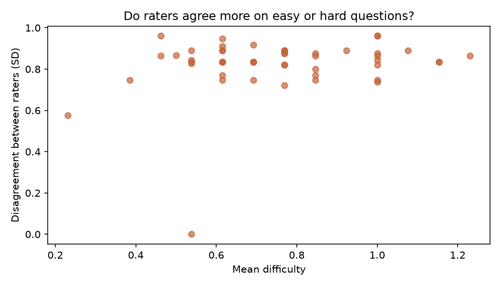

# Hardly

Predicts whether an exam question is easy or hard, using difficulty ratings collected from real students.

## The problem

Students don't know which topics to prioritise. Past papers hold that information, but reading ten years of them by hand isn't practical.

Existing question-difficulty datasets don't exist for Indian university exams. So I collected my own.

## What it does

1. Extracts questions from JNTU Machine Learning question papers (PDF)
2. Cleans them with regex rules
3. Collects difficulty ratings via a student survey
4. Encodes each question using sentence embeddings
5. Trains a classifier to predict easy vs hard
6. Serves predictions through a Streamlit app

## Results

| Model | Accuracy |
|---|---|
| Baseline (always predict majority) | 0.64 |
| Logistic regression on embeddings | 0.70 |

5-fold stratified cross-validation, 50 questions.

Regression on the raw difficulty score reached R² = 0.13. Classification proved more achievable with this sample size.

## The main finding

Inter-rater agreement was low. Mean standard deviation across raters was 0.82 on a 0–2 scale, and it did not vary with question difficulty — raters disagreed about easy questions as much as hard ones.

Individual raters also differed sharply in strictness: average scores ranged from 0.25 to 2.0 across the same 50 questions.

This suggests perceived difficulty is substantially rater-dependent, which places a ceiling on how well any model can predict it from question text alone.

## What didn't work

- **Hand-engineered features** (question length, verb type, marks, sub-part count) scored R² = -0.14, below baseline. The intuition that "prove" signals harder questions than "define" did not hold in this data.
- **Removing low-variance raters.** Five of 13 raters gave identical answers to all 50 questions. Removing them dropped accuracy from 0.70 to 0.64 — fewer raters meant noisier per-question estimates.

## Data

- 4 JNTU Machine Learning papers (2022–2024), 99 questions extracted
- 50 questions surveyed
- 16 responses, 13 usable after filtering non-students

Question papers are not included in this repo. Download them from JNTU sources and place them in `data/raw_pdfs/`.

## Running it